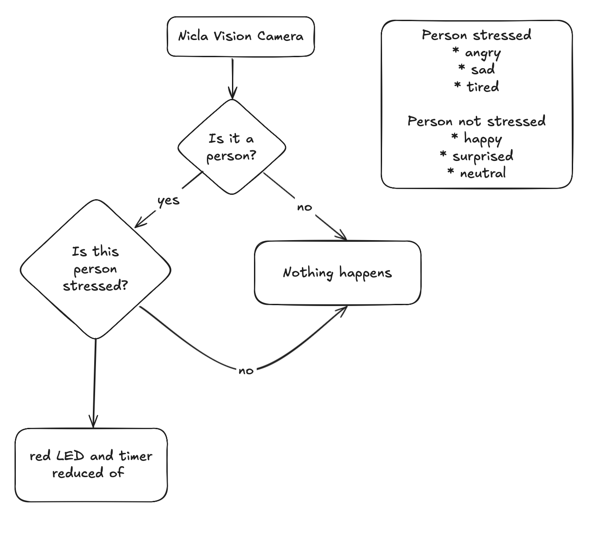

# Mood Sip

## Overview

MoodSip is an **smart assistant** for intelligent hydratation based on the user feelings and needs. It is built on the **Arduino Nicla Vision** board. It proactively suggests when you should drink water by combining multiple data sources: computer‑vision models, stress detection, motion sensors, and ambient temperature.

### Strategy

Place the bottle on your desk while working.
Its internal timer starts automatically, taking into account the current external temperature and the duration of your last drinking break.

When the timer reaches zero, the bottle blinks its onboard blue LED on the Nicla Vision, providing a clear visual reminder to drink.
MoodSip also monitors the user’s stress level—detecting emotions such as fatigue, anger, or sadness—and can shorten the remaining timer accordingly, encouraging faster hydration.

Using its onboard accelerometer, the bottle can also detect when you pick up or tilt it, confirming that you are actually drinking.

#### Facial expression analysis

The implementation is structured in two stages, carried out by a combination of both onboard models (powered by [Focoos AI](https://focoos.ai) and [Z-Ant](https://github.com/ZantFoundation/Z-Ant)) Facial expression analysis is , and LLM, running in the cloud.

1. Onboard Monitoring – The Nicla Vision camera continuously observes the user and tracks environmental factors as well as previous drinking patterns. Using a classification model, it detects whether a person is present, standing near, or sitting in front of the bottle.

The clasification dataset used for the model is MIT Indoor Scene Recognition (on Roboflow) and Celebrity face Image Dataset (on Kaggle).

2. Mood Analysis via Companion App – When connected to the MoodSip Companion App, a cloud-based AI (Gemini 2.5 Flash) analyzes the user’s facial expressions to assess stress or mood, confirming whether a hydration prompt is needed.

The communication is done thorugh BLE.

The onboard models are used to detect whether the user is present and sitting in front of the bottle.

We then delegate the "heavy lifting" to the more performant AI model that can tell us whether the user is stressed or not more accurately.

## Technical implementation

The vision model running on the board has been trained using the Focoos AI SDK, and then quantized to 8 bits.

The deployment was carried out using Z-Ant.

### Key Features

- **Computer Vision** – Detects facial expression using a combination of onboard vision models and hosted AI.
- **Temperature Sensing** – Monitors ambient temperature to recommend extra hydration during hot conditions.
- **Bluetooth Low Energy** – Enables communication from the Nicla Vision board.
- **Motion & Orientation** – Accelerometer and gyroscope track shaking and tilting to understand when the user is drinking.

## Software Stack

| Layer             | Technology       | Purpose                                               |
| ----------------- | ---------------- | ----------------------------------------------------- |
| Firmware          | Arduino IDE      | Core logic, sensor reading, BLE communication         |
| Computer‑Vision   | Focoos AI        | Detect the user when in view of the camera            |
| Vision deployment | Z-Ant            | Deploy quantized vision model to Arduino Nicla Vision |
| AI Model          | Gemini 2.5 Flash | Predict stress from facial expressions                |
