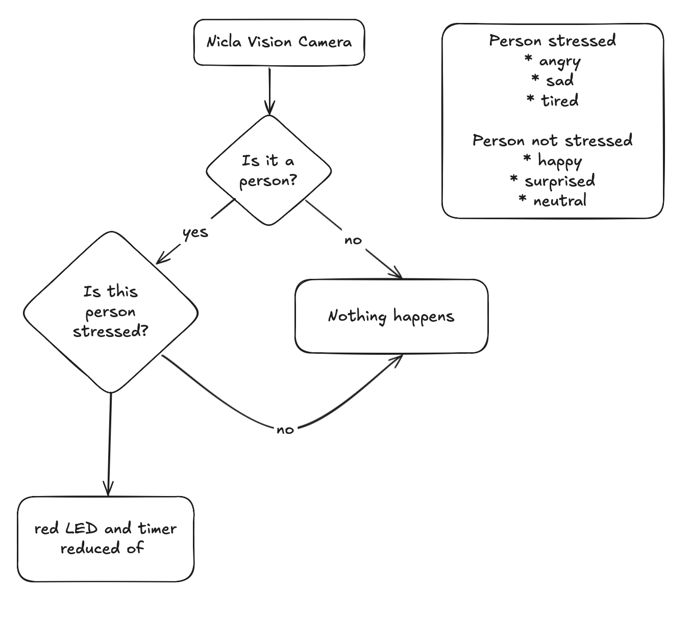

# Mood Sip

> Mood Sip is your new favorite hydration assistant!

## Overview

The **Smart Bottle** is an intelligent hydration assistant built on the **Arduino Nicla Vision** board. It proactively suggests when you should drink water by combining multiple data sources: computer‑vision models, stress detection, motion sensors, and ambient temperature.

### Strategy

Place the bottle on your desk while working.
Its internal timer starts automatically, taking into account the current external temperature and the duration of your last drinking break.

When the timer reaches zero, the bottle blinks its onboard LED on the Nicla Vision, providing a visual notification.
The device also monitors your stress level—detecting emotions such as sadness, anger, or fatigue—and will shorten the remaining time accordingly, prompting a quicker drink.

Using its onboard accelerometer and gyroscope, the bottle can also detect when you pick up or tilt it, confirming that you are actually drinking.

#### Facial expression analysis

Facial expression analysis is carried out by a combination of both onboard models (powered by [Focoos AI](https://focoos.ai) and [Z-Ant](https://github.com/ZantFoundation/Z-Ant)), and Gemini 2.5 Flash, running in the cloud.

The onboard models are used to detect whether the user is present and sitting in front of the bottle.

We then delegate the "heavy lifting" to the more performant AI model that can tell us whether the user is stressed or not more accurately.

### Key Features

- **Computer Vision** – Detects facial expression using a combination of onboard vision models and hosted AI.
- **Temperature Sensing** – Monitors ambient temperature to recommend extra hydration during hot conditions.
- **Bluetooth Low Energy** – Enables communication from the Nicla Vision board.
- **Motion & Orientation** – Accelerometer and gyroscope track shaking and tilting to understand when the user is drinking.

## Software Stack

| Layer             | Technology       | Purpose                                               |
| ----------------- | ---------------- | ----------------------------------------------------- |
| Firmware          | Arduino IDE      | Core logic, sensor reading, BLE communication         |
| Computer‑Vision   | Focoos AI        | Detect the user when in view of the camera            |
| Vision deployment | Z-Ant            | Deploy quantized vision model to Arduino Nicla Vision |
| AI Model          | Gemini 2.5 Flash | Predict stress from facial expressions                |
